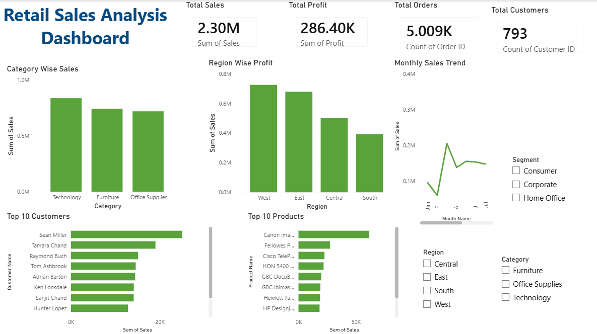

# Retail Sales Analysis Dashboard #

## Project Overview
This Power BI dashboard analyzes retail sales performance across categories, regions, customers, and products.

## Tools Used
- Python
- Power BI
- Excel/CSV
- Data Cleaning
- Data Visualization

## Dashboard Features
- Total Sales KPI
- Total Profit KPI
- Total Orders KPI
- Total Customers KPI
- Category Wise Sales
- Region Wise Profit
- Monthly Sales Trend
- Top 10 Customers
- Top 10 Products
- Interactive Slicers

## Dashboard Screenshot

## Insights
- Technology category generated highest sales.
- West region contributed highest profit.
- Consumer segment generated maximum revenue.
- Top customers contributed significant sales volume.
